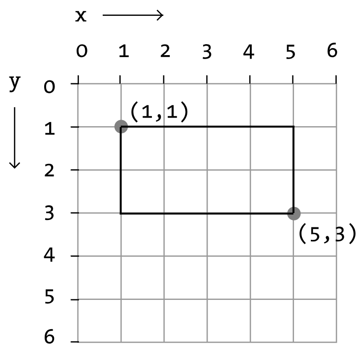

[](https://classroom.github.com/a/wp9paGMg)
# Atividade prática

- A prova possui duração total de 1 hora e 40 minutos.
- Leia atentamente cada questão antes de responder e verifique se entendeu o que é pedido.
- Não é permitido consultar livros, notas de aula ou qualquer material externo durante a prova.
- Utilize a linguagem de programação C para resolver os exercícios.
- Caso haja alguma dúvida, levante a mão e aguarde a chegada do professor.

1. Matrizes (Valor: 30 pontos)

    Considere a seguinte matriz quadrada de ordem `3x3`:

    ```c
    int matriz[3][3] = {
        {1, 2, 3},
        {4, 5, 6},
        {7, 8, 9}
    };
    ```
    1. Escreva na função `main` um trecho de código em C que calcule e imprima a soma de todos os elementos da matriz.
    1. Escreva uma função em C que receba a matriz como parâmetro e retorne a matriz transposta (inverter linhas e colunas).


1. Ponteiros (Valor: 20 pontos)

    Implemente uma função em C chamada "inverterString" que receba uma string como parâmetro (ponteiro para char) e inverta-a. A função deve ser capaz de inverter a string sem alocar memória extra.
    ```c
    char str[] = "hello";
    inverterString(str);
    printf("%s", str); // Deve imprimir "olleh"    
    ```

1. Ponteiros, Estruturas e Alocação Dinâmica (Valor: 50 pontos)

    1. Crie uma estrutura (struct) em C chamada "Ponto" com os campos x e y, ambos do tipo `int`.
    1. Escreva uma função em C chamada "criarPonto" que receba como parâmetros dois valores `int` (x e y) e retorne um ponteiro para uma estrutura "Ponto" alocada dinamicamente com esses valores.
    1. Escreva uma função em C chamada "distanciaPontos" que receba dois ponteiros para estruturas "Ponto" como parâmetros e retorne a area do retângulo formado por esses dois pontos. 
    
    1. Escreva a função `main` parar criar dois pontos e soliciar o cálculo da área do retângulo como na imagem acima. 